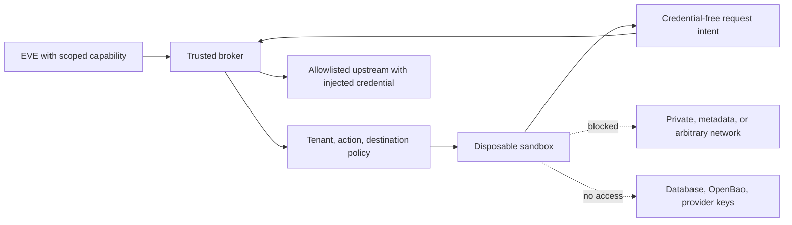

# Connectors and sandbox

Apply connector rules only to enabled/observed connectors, MCP or webhooks. Apply sandbox rules only to enabled/observed untrusted execution. Ordinary trusted application code does not activate a sandbox requirement.

## Connector boundary

- **CONN-001 — Capability-bound tools.** Every tool call **MUST** carry an expiring capability bound to audience, resource, action, workspace, data class, risk class, and approval requirement. Subagents receive attenuated capabilities and no ambient credentials.
- **CONN-002 — Connector credentials.** Access and refresh tokens **MUST** remain encrypted references outside agents and sandboxes. Refresh **MUST** be single-flight and revoke on disable, deprovision, or policy loss.
- **CONN-003 — Trusted outbound fetch.** Connector and MCP HTTP **MUST** revalidate every redirect, couple DNS validation to the actual connection, reject private/loopback/link-local/metadata/multicast targets, strip cross-origin credentials, and bound method, port, path, body, response, and time.
- **CONN-004 — MCP token separation.** MCP access tokens **MUST** be resource/audience-bound and validated on every request; because MCP `2026-07-28` accepts or rejects each request independently, validation **MUST NOT** rely on session or handshake state. An inbound token **MUST NOT** be forwarded to an upstream API; use a separate downstream credential and per-client consent. [MCP-SPEC]
- **CONN-005 — Webhook admission.** Webhook ingress **MUST** verify a signature over the raw bounded body, enforce timestamp/replay windows and event dedupe, derive the workspace from server-owned mappings, and durably admit before acknowledgement.

Classify tools as read-only, reversible write, irreversible/external effect, privileged administrative, or untrusted execution. Default-deny unknown tools. High-risk or capability-escalating calls require an EVE approval gate with reason, expiry, actor, decision, and immutable audit.

Target MCP spec revision `2026-07-28`: each request declares its protocol version via `io.modelcontextprotocol/protocolVersion` in `_meta` (mirrored in the `MCP-Protocol-Version` header on Streamable HTTP), servers implement the mandatory `server/discover` RPC advertising supported versions, capabilities, and identity, and unsupported versions fail with `UnsupportedProtocolVersionError` for a retry at a mutually supported revision. <!-- source: MCP-SPEC --> Track the spec's deprecated-features registry; deprecated features carry a minimum twelve-month removal window (ninety days expedited), so plan migrations from it rather than from breakage. <!-- source: MCP-SPEC --> [MCP-SPEC]

## Sandbox boundary

- **SBX-001 — Untrusted execution.** Production untrusted code **MUST** use a provider sandbox uniquely bound to workspace, run, and trust class. Local execution is trusted-development only.
- **SBX-002 — Credential-free sandbox.** A sandbox **MUST NOT** receive database, secret-store, model-provider, connector-refresh, or ambient object-store credentials. Trusted broker code MAY inject an upstream credential only after validating a short-lived capability and must never return it. [tier: all]
- **SBX-003 — Default-deny egress.** Egress **MUST** default deny. Trusted policy **MUST** constrain destination, method, path, headers, redirects, body, and response; discard sandbox-provided `Authorization`, cookies, and `Host` before reconstructing the request. [tier: all]
- **SBX-004 — Disposable execution.** Enforce CPU, memory, disk, process, network, output, and time quotas plus cleanup and sweeper reconciliation. Correctness and durable state **MUST NOT** depend on sandbox process or filesystem survival.
- **SBX-005 — Provider contract.** A provider **MUST** declare isolation, lifecycle, quotas, network controls, file transfer, streaming, cleanup, region/jurisdiction, and capability stability; conformance tests determine support.

Cloudflare Sandbox is preferred and Modal is the main alternative behind `SandboxProvider`. Cloudflare outbound Internet is open unless explicitly restricted: set `allowedHosts`, which becomes a deny-by-default allowlist once configured, plus `deniedHosts` for explicit blocks; route credentialed egress through outbound handlers, changeable at runtime via `setOutboundHandler()`; per-instance TLS interception (an ephemeral CA per sandbox, available since `@cloudflare/sandbox` 0.8.9) extends handler policy to HTTPS. <!-- source: CF-SANDBOX --> The API accepts glob patterns; SBX-003 still requires deny-by-default egress without wildcards, so allowlists pin exact hosts. Modal also requires explicit network restriction. [CF-SANDBOX] [MODAL-SANDBOX]

Test IPv4/IPv6, DNS rebinding, redirect hops, header stripping, token expiry/replay, cross-tenant sandbox IDs, credential-bearing errors/responses, quota, timeout, cancellation, crash, and cleanup.
