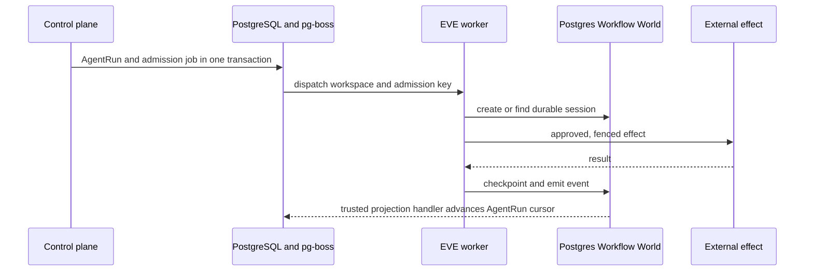

# Durable execution

Apply EVE/Workflow/AgentRun rules only when agents are enabled or observed. Apply pg-boss rules only when owned agent admission or ordinary jobs are enabled or observed. A non-agentic project does not require EVE, Workflow World, AgentRun or pg-boss.

Minimum viable form by tier — prototype: agents MAY run as simple in-process loops with at-least-once effects and a named migration path to durable execution; ordinary background work MAY use plain cron/queue primitives. The `DUR-*` ownership and qualification rules bind from production tier, where crash recovery and replay become real requirements — the trigger for EVE/pg-boss is durable multi-step agent work that must survive restarts, not the presence of agents alone.

## Exclusive ownership

- **DUR-001 — One workflow owner.** EVE with its compatible PostgreSQL Workflow World **MUST** exclusively own durable agent sessions, steps, waits, approvals, continuations, hooks, streams, and tool-loop state. Do not introduce a second workflow engine, tool loop, HITL store, or execution queue.
- **DUR-002 — Exact production tuple.** Production **MUST** pin `eve@0.29.5` and `@workflow/world-postgres@5.0.0-beta.30`; the lock **MUST** resolve its compatible `@workflow/world@5.0.0-beta.23` and `@workflow/world-local@5.0.0-beta.32`. Upgrade the family atomically. Local Workflow Worlds/files are development-only and forbidden in production. [EVE-PINNED] [WORKFLOW-PG]
- **DUR-003 — Admission owner.** pg-boss **MUST** own transactional application admission and ordinary background jobs only. It **MUST NOT** model EVE execution state or use flow features as a second agent workflow engine. [PGBOSS-1227]
- **DUR-004 — Product record.** AgentRun **MUST** retain authoritative product/audit inputs and a cursor-versioned projection of EVE events. Projection is required behavior in a trusted long-running plane, not a required standalone deployable. It **MUST** declare its source, direction, reconciliation, and monotonic update rule; it is not replay truth.
- **DUR-005 — Transaction boundary.** The control plane **MUST** create AgentRun and one pg-boss admission job in the same PostgreSQL transaction when possible. The job carries the deterministic admission key and AgentRun records pending/accepted audit state plus the unique EVE session reference. Use an outbox only when a transaction or database boundary prevents atomic enqueue.
- **DUR-006 — External effects.** Every retried external effect **MUST** use an idempotency/effect fence and reconciliation. Job claiming or step replay is not proof of exactly-once external side effects.
- **DUR-007 — Replay qualification.** Before the production tier, durable execution **MUST** reproduce crash behavior before/after checkpoints and effects, completed-step replay, interrupted-step idempotency, approval persistence, wait/resume, cancellation, cursors, mixed-version migration, and PostgreSQL recovery for the exact tuple.
- **DUR-008 — Tenant-qualified World.** Before shared-database production, every tenant-bearing Workflow World record and service role **MUST** satisfy `TEN-001` through `TEN-004`. A tuple that cannot preserve that boundary **MUST** fail qualification; RLS weakening, owner roles, and `BYPASSRLS` are forbidden.
- **DUR-009 — Workflow exit contract.** Owning the workflow engine does not exempt it from provider neutrality: production durable execution **MUST** maintain an exit/migration contract naming the engine-specific constructs in use (sessions, steps, waits, approvals, hooks, streams), an exportable schema for durable session and event state, a drain/quiesce procedure, and a documented migration path with rollback to a replacement engine or major version. The contract is reviewed with the same cadence as the pinned tuple; a lock without an exit plan is accepted risk, not neutrality.

## Admission and recovery

Use `(workspace_id, admission_key)` as the logical start key. After a lost acknowledgement, look up the same EVE session before retrying; a retry never creates another logical run. The trusted EVE-event projection handler, not the admission job, supplies terminal execution state; it MAY run inside an existing trusted long-running deployable.

Use pg-boss groups/priority plus measured wait age for ordinary tenant fairness. Add a separate selector/lease table only when reproduced strict global quota or starvation requirements exceed pg-boss semantics; that extraction needs an ADR and must not model EVE execution.

Configure bounded retries/backoff, heartbeats, dedupe, attempt history, DLQ/redrive, inspect/cancel operations, and graceful shutdown. Redrive reuses the same admission key and effect fence. LISTEN/NOTIFY MAY reduce latency, but polling remains the safety path. [PGBOSS-1227]

Do not assume same-session FIFO unless reproduced for the exact tuple.

Qualification evidence remains tuple-specific and environment-specific. The pinned `eve@0.29.5` tuple is beta; <!-- source: EVE-PINNED --> `@workflow/world-postgres` remains a `5.0.0-beta` line, and the workflow SDK reaching GA is a mandatory human re-review trigger for `DUR-002` and `DUR-009` — re-evaluate the pin, the migration path, and the exit contract at that point rather than upgrading silently. <!-- source: WORKFLOW-PG -->
