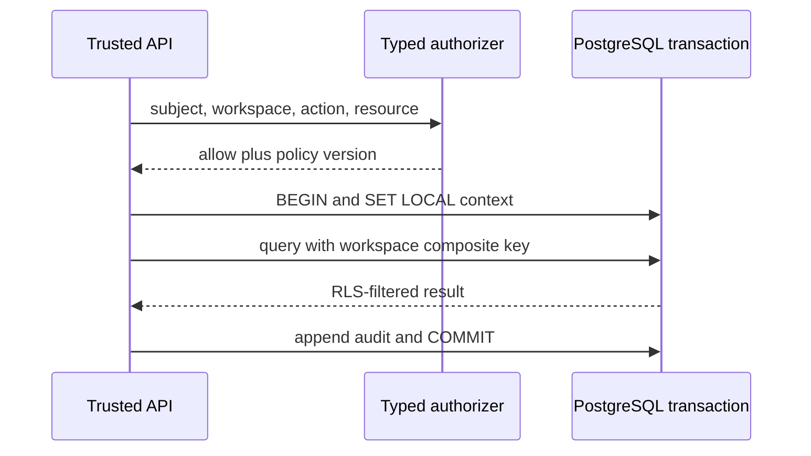

# Identity and tenancy

Apply identity rules only to authenticated/delegated/service access that exists. Apply organization rules to multi-tenant workspace products. Apply `TEN-*` rules to shared-schema multi-tenancy; public, single-tenant and isolated-database projects do not acquire RLS requirements merely by using VegaStack.

## Identity boundary

- **AUTH-001 — Workspace boundary.** For authenticated multi-tenant products, Better Auth organization **MUST** be the workspace boundary. A client-supplied or session-cached active organization **MUST NOT** authorize access without current membership resolution. Projects MAY subdivide a workspace.
- **AUTH-002 — Resource authorization.** `owner`, `admin`, and `member` are coarse membership roles; teams are grouping only. Application-owned typed resource policies and grants **MUST** be authoritative and default-deny. [BETTERAUTH-ORG]
- **AUTH-003 — Browser sessions.** Browser authentication **MUST** use secure, HttpOnly, SameSite cookies. CSRF/origin checks **MUST NOT** be disabled; production origins **MUST** be exact HTTPS allowlists. Sensitive actions **MUST** revalidate the session and current membership against durable storage rather than trusting cookie cache. [tier: all] [BETTERAUTH-SESSIONS] [BETTERAUTH-SECURITY]
- **AUTH-004 — Delegated clients.** Flutter, MCP, delegated applications, and third parties **MUST** use authorization code with S256 PKCE, discovery, explicit consent, audience/resource validation, refresh rotation, revocation, and introspection. Reject `require_pkce: false`; do not use the Bearer plugin as the mobile foundation. Verify that OAuth and OIDC discovery endpoints are reachable outside framework catch-all routes. [BETTERAUTH-OAUTH]
- **AUTH-005 — Automation and services.** Workspace API keys **MUST** be organization-owned, hashed, scoped, expiring, rate-limited, and revocable. Internal service-to-service identity **MUST** be short-lived and audience-bound — OpenBao-issued identities with mTLS where the multi-service trigger is met, platform-issued identities otherwise. Neither identity may synthesize a browser session. [BETTERAUTH-APIKEY] [OPENBAO-DOCS]
- **AUTH-006 — Enterprise provisioning.** SSO and SCIM connections **MUST** be organization-scoped. Production `defaultSCIM` and plaintext SCIM token storage are forbidden. Deprovisioning **MUST** revoke sessions, memberships, grants, API keys, connector access, and support elevation. [tier: enterprise] [BETTERAUTH-SSO] [BETTERAUTH-SCIM]
- **AUTH-007 — Support elevation.** Support access **MUST** be visible, reason/ticket-bound, narrowly scoped, expiring, revocable, and immutable-audited. It **MUST NOT** impersonate a user or bypass normal RLS.

## Tenant database boundary

- **TEN-001 — Composite tenant keys.** Every tenant-owned primary, unique, and foreign-key relationship **MUST** include `workspace_id`; a globally unique object ID is not tenant isolation. [tier: all]
- **TEN-002 — Forced RLS.** Every tenant table **MUST** enable and force PostgreSQL RLS with fail-closed `USING` and `WITH CHECK` coverage appropriate to each command. [tier: all] [POSTGRES-DOCS]
- **TEN-003 — Trusted transaction context.** Request roles **MUST** be non-owner and lack `BYPASSRLS`. Trusted server code **MUST** establish workspace, subject, and support context using `SET LOCAL` or `set_config(..., true)` inside the same explicit transaction as protected queries. Clients and pooled session state **MUST NOT** set it. [tier: all]
- **TEN-004 — Privileged and batch paths.** Bulk, export, background, support, and maintenance paths **MUST** preserve tenant context. A `SECURITY DEFINER` function **MUST** use a fixed safe `search_path`, revoke public execution, validate tenant inputs, and avoid an RLS-bypassing owner. [tier: all]

Use cache-disabled database paths for auth, session, permission, and RLS-sensitive reads. Hyperdrive transaction pooling resets session state and eligible cached reads do not provide authorization freshness. [HYPERDRIVE]

Qualification includes applicable cross-workspace IDs, joins, subqueries, composite foreign keys, inserts/updates, exports, background jobs, migrations, pool reuse, support expiry, role ownership, `SECURITY DEFINER`, SCIM deprovisioning, and session revocation.
