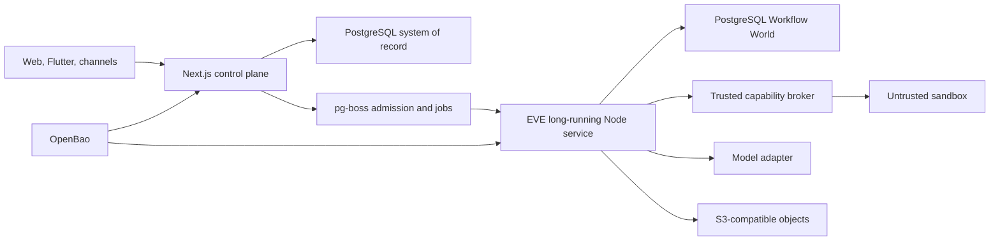

# Topology and monorepo

The topology is composable. Include only enabled project-owned capabilities; shared/external providers sit behind declared contracts and need no consumer source root.

## Runtime ownership

- **RUN-001 — EVE placement.** EVE **MUST** run as a separate officially supported long-running Node/OCI service and **MUST NOT** run inside an OpenNext Worker or request-lifetime function. Pinned `eve@0.29.5` requires Node 24+, and its PostgreSQL Workflow World needs a long-lived worker. [EVE-PINNED] [WORKFLOW-PG]
- **RUN-002 — Job placement.** pg-boss workers **MUST** run in a separate supported Node/OCI placement, never inside the OpenNext request bundle.
- **RUN-003 — Explicit provider boundary.** Provider-specific compute, storage, model, and sandbox behavior **MUST** remain behind declared adapters and hosting profiles.
- **RUN-004 — Runtime qualification.** Bun compatibility **MUST NOT** be treated as proof that a deployable is supported on Node, Workers, Flutter, or another production runtime.

| Component | Owns | Must not own |
|---|---|---|
| Next.js | UI, RSC, Route Handlers, Better Auth, REST/OpenAPI, admission transaction | long-running execution |
| pg-boss | transactional admission and ordinary jobs | EVE sessions, steps, waits, approvals, hooks, or streams |
| EVE + Postgres World | durable agent execution state | business admission/fairness queue |
| AgentRun | product/audit inputs and execution projection | workflow replay internals |
| sandbox broker/provider | isolated execution and scoped capabilities | database, OpenBao, or provider credentials |
| PostgreSQL | business truth, jobs, Workflow World, FTS/vector metadata | binary object payloads |

OpenNext supports the selected Next.js request surface, but Workers provides only a subset of Node APIs; `nodejs_compat` is not a general Node process. [OPENNEXT-1202] [CF-WORKERS]

## Workspace and packages

Use a Bun/Turborepo workspace for JavaScript/TypeScript and Flutter orchestration. Production deployables use their supported runtimes.

- **PKG-001 — Directed package graph.** Apps **MUST NOT** import another app's internals. Domain packages **MUST NOT** depend on Next.js, Flutter, UI, or provider SDKs; adapters depend on provider-neutral contracts.
- **PKG-002 — Generated contracts.** Zod is editable API source; OpenAPI, Flutter/public clients, schema snapshots, and the packaged skill copy **MUST** be deterministic outputs with source and tool digests.
- **PKG-003 — Dependency qualification.** Security, runtime, and durability protocol families **MUST** be pinned and upgraded atomically with compatibility, migration, replay, and rollback tests.
- **PKG-004 — Production graph qualification.** CI **MUST** validate the install graph and every pruned production graph, public exports, dependency cycles, and lockfile consistency; registry integrity and SBOM/provenance attestation bind at enterprise tier.

Commit generated public contracts needed by consumers. [TURBO-DOCS] [BUN-DOCS]
